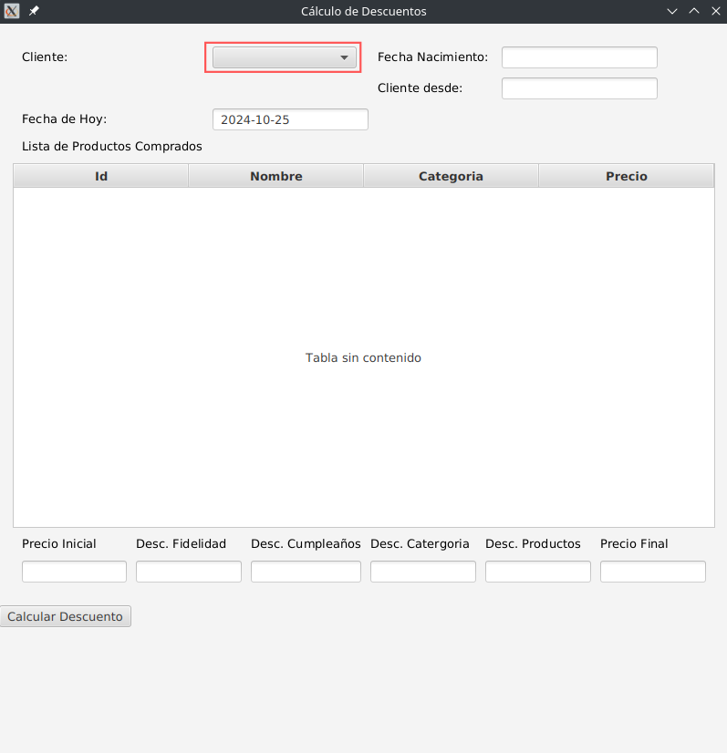

# Evaluación Resiliencia II-2024

### Asignatura: Patrones de Software y Programación

### Profesor: Daniel San Martín

Nombre Estudiante:

Rut Estudiante:

**La evaluación tiene un puntaje total de 90 pts, 60% de exigencia.**

### Resultados de Aprendizaje

1.	Aplicar patrones de diseño para crear un software de acuerdo a estándares de seguridad y desempeño
2.  Caracterizar patrones de diseño de acuerdo a su nivel de aplicabilidad a los problemas.

### Instrucciones

1. Esta evaluación tiene $4$ páginas  (incluyendo la portada) y $3$ preguntas. Compruebe que dispone de todas las páginas. Responda a las preguntas en los espacios previstos para ello en las hojas de preguntas. Asegúrese de marcar apropiadamente sus respuestas.
2. Durante la prueba no se puede utilizar: teléfono móvil, calculadora, apuntes u otras fuentes de información.
3. Está prohibido intentar conectarse a internet de cualquier manera. Si es sorprendido obtendrá la calificación mínima. Tampoco puede utilizar dispositivos de almacenamiento externos o cualquier otro dispositivo relojes inteligentes.
4. Lea la prueba completamente DOS veces antes de hacer cualquier pregunta
5. Una prueba respondida correctamente en un $60\%$, de acuerdo a las ponderaciones asignadas, corresponde a una nota $4,0$.
6. Solamente se pueden realizar preguntas durante los primeros $40$ minutos de la prueba. Solo se responderán preguntas respecto a los enunciados a viva voz.
7. La prueba es individual, cualquier sospecha de copia será calificada con la nota mínima y el caso será remitido al comité de ética.
8. En su espacio personal no debe haber nada más que hojas de papel en blanco, lápiz y goma.
9. Los estudiantes quienes se les compruebe falta de honestidad académica o cualquier otro acto contrario a las normas de permanencia universitaria o al espíritu universitario, serán sancionados, según sea la gravedad de la falta, con medidas desde la amonestación verbal hasta la suspensión o pérdida de la condición de estudiante, los estudiantes expulsados no podrán volver a ingresar a ninguna carrera, programa o curso de la institución. El estudiante que incurriere en falta de honestidad, durante la realización de un proceso evaluativo, será calificado con la nota mínima $1,0$.
10. El resto de sus implementos debe guardarlos dentro de su mochila/bolso y ésta debe posicionarse al frente debajo de la pizarra. Si leyó hasta este punto, felicidades, para saber que lo hizo dibuje una estrella al final de esta página.

### Enunciado

Usted como ingeniero de software, debe modificar un sistema que calcula el precio final de productos aplicando descuentos.
El cálculo del descuento está acoplado directamente en la clase DescuentoManager. Actualmente, existen tres tipos de
descuentos:

1. **Descuento por fidelidad**: Cuando el año de registro de un cliente es mayor o igual a 2 años con respecto a la fecha
   actual.
2. **Descuento por Cumpleaños**: Cuando la fecha de nacimiento (mes y día) coinciden con la fecha actual.
3. **Descuento por Categoría**: Cuando por lo menos existe un producto que está siendo comprado en la categoría "casa".
4. **Descuento por Cantidad de Productos**: Cuando la cantidad de productos comprados es mayor a dos productos.

Su tarea es modificar el sistema para implementar el patrón Decorator, de modo que los descuentos se puedan aplicar de
forma acumulativa. El código del proyecto se encuentra alojado en repositorio github: [https://github.com/IS-LAB-EIC-UCN/Resiliencia-II-2024](https://github.com/IS-LAB-EIC-UCN/Resiliencia-II-2024).

### Características del sistema

El sistema incluye cuatro clases modelo: Cliente, Producto, GerenciadorDescuento y Servicio. El proyecto está implementado
en JavaFX para IntelliJ, lo que le permite interactuar con una ventana gráfica que contiene controles de interfaz de
usuario (UI). Para ejecutar el programa, abra un terminal en su IntelliJ y ejecute el siguiente comando:

                                  mvn clean javafx:run

Después de algunos segundos aparecerá la pantalla del sistema de cálculo de descuentos. En la parte superior están
los datos del cliente. En la parte de al medio, los productos comprados por el cliente y finalmente en la parte
inferior, al presionar el botón _calcular descuento_ se mostrarán los descuentos aplicados de acuerdo a las reglas
presentadas en el enunciado. Para que se muestren los datos del cliente y los productos comprados, debe escoger al cliente
seleccionándolo desde el Combobox, marcado con un rectángulo rojo en la figura (control que se encuentra al lado del label _Cliente:_).

Los datos se encuentran precargados en el sistema en una base de datos SQLite llamada bazar.db, por lo que usted no
deberá ingresar nuevos datos. Además, como su tarea es refactorizar el sistema, el comportamiento debe ser el mismo
una vez implementado el patrón de diseño.

### Evaluación

1. Implementar el patrón de diseño decorator aplicar descuentos acumulativos. Cree una nueva Carpeta o Paquete en el
   proyecto con nombre **_solucion_ (cl.ucn.solucion)**. Modifique la clase GerenciadorDescuento
   e implemente nuevas clases para implementar el patrón (**50 pts**).
2. Explique porqué es adecuada la implementación del patrón Strategy para este proyecto y que principio de diseño
   atiende. Puede apoyarse con algún diagrama de clases construido con su editor de diagrama favorito o a mano (**20pts**).
3. Implemente una nueva forma de descuento con la siguiente regla: Cada vez que el total de compras sea superior a 50.000
   se aplicará un descuento del 10%. (**20pts**)

### Informaciones

En la clase Main.java, se encuentra la lógica que implementa la interfaz gráfica. Las líneas de código que son importantes
para esta evaluación y que podrían ser afectas a modificación son las siguientes:

1. Desde las línas 89-111, se declaran los controles para etiquetas (labels) y textos de entrada (text inputs) para
   los descuentos. Si necesitara nuevos controles para mostrar un nuevo descuento por ejemplo, tendría que codificar lo siguiente:

       Text nuevoDescuentoLbl = new Text("Nuevo Descuento");
       TextField nuevoDescuentoTxt = new TextField();
       nuevoDescuentoTxt.setEditable(false);
2. Adicionar los controles creados al control _gridPane2_ (después de la línea 170 y 177) con la siguiente codificación:

       gridPane2.add(nuevoDescuentoLbl, 5,0); //adicionar en la linea 171
       gridPane2.add(nuevoDescuentoTxt, 5,1); //adicionar en la linea 178

Desde las líneas 116-134, se implementa la lógica asociada al botón _Calcular Descuento_. Se describe una breve explicación
de cada línea.

1. Creación del botón

       Button calcularDescuentoBtn = new Button("Calcular Descuento");
2. Obtención del cliente seleccionado: Se obtiene el cliente desde el ComboBox (desplegable) que ha sido
   seleccionado.

       Cliente clienteSeleccionado = comboBox.getValue();

3. Instanciación de la clase Servicio: Se obtienen los productos asociados a un cliente (rut).

       Servicio servicio = new Servicio(em);
       List<Producto> productos = servicio.getProductosByRut(clienteSeleccionado.getRut());

4. Cálculo de descuentos:

       GerenciadorDescuento gerenciadorDescuento = new GerenciadorDescuento();
       List<Integer> precios = gerenciadorDescuento.calcularPrecioFinal(productos,
       clienteSeleccionado.getFechaNacimiento(),
       String.valueOf(clienteSeleccionado.getAnhoRegistro()),
       fechaActualTxt.getText());

5. La instancia _GerenciadorDescuento_, encapsula la lógica para calcular varios descuentos. El método calcularPrecioFinal()
   recibe la lista de productos y otros parámetros como la fecha de nacimiento del cliente, el año en que se registró y una fecha
   actual ingresada por el usuario. Este método devuelve una lista de enteros que corresponden a los precios calculados,
   incluidos los descuentos. A continuación el código que permite la visualización de los descuentos.

       precioInicialTxt.setText(String.valueOf(precios.get(0)));
       descuentoFidelidadTxt.setText(String.valueOf(precios.get(1)));
       descuentoCumpleanhosTxt.setText(String.valueOf(precios.get(2)));
       descuentoCatergoriaTxt.setText(String.valueOf(precios.get(3)));
       descuentoProductosTxt.setText(String.valueOf(precios.get(4)));
       precioFinalTxt.setText(String.valueOf(precios.get(5)));

Finalmente, se muestran los precios y los diferentes descuentos en varios campos de texto de la
interfaz gráfica.

### Respuestas

**Importante**: El envío de su proyecto es por plataforma campus virtual en formato .zip o .rar. Verifique que sus cambios
realmente han sido guardados antes de crear el archivo comprimido. (**Buena Suerte!**)

2. La implementación del patrón Strategy es adecuada para este proyecto porque permite separar las distintas 
lógicas de descuento en clases independientes y facilita la extensión y modificación de estas sin afectar el 
código cliente. Esto es especialmente útil en situaciones donde se tiene múltiples algoritmos o comportamientos 
que pueden intercambiarse en tiempo de ejecución, como sucede con las distintas formas de calcular descuentos 
en el proyecto.

**Principio de Diseño: "Abierto/Cerrado" (Open/Closed Principle)**
El patrón Strategy sigue el principio de diseño Abierto/Cerrado porque permite que el sistema esté abierto a 
la extensión, al añadir nuevas estrategias de descuento, y cerrado a la modificación, ya que no es necesario 
modificar las clases existentes para agregar una nueva estrategia. Además, el patrón Strategy reduce la  
complejidad del código al evitar estructuras condicionales y permite a cada estrategia centrarse en una única 
responsabilidad, alineándose con el Principio de Responsabilidad Única.

